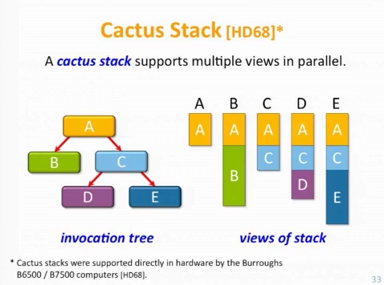
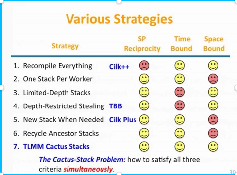

# Multithreaded memory management

## The cactus stack

A cactus stack happens when a task (for example fibonacci)
spawns N stacks, which then spawns M tasks.
Then the stacks of grandchildren are:
  - Root 1 -> 11 -> 111
  - Root 1 -> 11 -> 112
  - Root 1 -> 12 -> 121
  - Root 1 -> 12 -> 122
and pop-ing from those stacks doesn't translate to a linear memory pop

This is also called a [parent-pointer-tree](https://en.wikipedia.org/wiki/Parent_pointer_tree)



_Credits: Angelina Lee_

## Litterature

- A Practical Solution to the Cactus Stack Problem

  Chaoran Yang, John Mellor-Crummey

  http://chaoran.me/assets/pdf/ws-spaa16.pdf
- Using Memory Mapping to Support Cactus Stacks
  in Work-Stealing Runtime Systems

  I-Ting Angelina Lee, Silas Boyd-Wickizer, Zhiyi Huang, Charles E. Leiserson

  https://pdos.csail.mit.edu/~sbw/papers/pact183a-lee.pdf
- Proactive Work-Stealing for Futures

  Kyle Singer, Yifan Xu, I-Ting Angelina Lee

  https://www.cse.wustl.edu/~angelee/home_page/papers/ws-future.pdf

## Talk

- Memory abstractions for parallel programming

  I-Ting Angelina Lee

  https://www.microsoft.com/en-us/research/video/memory-abstractions-for-parallel-programming/

  https://www.youtube.com/watch?v=WQzftnojaDc

## C-compatible Implementation

- Fibril work-stealing scheduler

  Chaoran Yang

  https://github.com/chaoran/fibril

## The main issues

3 criteria to measure a solution to the cactus stack problem (Angelina Lee)
- Serial Parallel Reciprocity
  - No need to recompile legacy code to call it from a parallel program
- Space bound
  - No unbounded space growth due to parallelism
- Fast
  - Should allow scalabilty on problems that expose enough parallelism
    compared to the number of hardware threads.


_Credits: Angelina Lee_

Assuming an unbounded number of tasks:
- They are created in one thread and moved to another
- They might be allocated rapidly
- On each thread, we have last-in first-out
- In-between threads there is no ordering
- After usage, they are destroyed or recycled but not from the creating thread.
- We need heuristics to return memory to the OS on unbalanced long-running tasks (say scientific simulations)

Hardware constraints:
- We want a portable solution compatible with C calling convention. Cilk solution for example is not suitable.
- We want a cross hardware solution. Fibril solution requires assembly to save registers and so is last resort.




_Credits: Angelina Lee_

### Cactus stack in Picasso

No specific technique is used in Picasso: no leapfrogging or depth-restricted parallelism.
Worker stacks are allocated on thread creation with Nim stack size default.

## Multithreaded memory management techniques

See [](memory_access_patterns) on the tradeoff descriptions of each type

#### Tasks

Tasks are the main challenge to tackle regarding memory management.
The number of tasks created is unbounded and depends on the task "forking factor"
and number of processors.
The naive fibonacci computation will for example create 2^n tasks.

Tasks are created in a cactus-stack like manner and if work is unbalanced
tasks object will not be released by the thread that created them.

#### Steal requests

While steal requests also present inter-thread memory management challenges,
they cannot spawn an unknown amount of steal requests
and are completely bounded by `MaxSteal * num_threads`

#### Futures / Flowvars

Futures (Flowvars) are the unidirectional channels open for the task executor
to send the result back to the task spawner.

User routines can create an unbounded amount of nested futures.

More investigation is needed on their memory usage pattern.
Herlihy recommends disciplined use of futures to provide a bounded
number of cache misses.
The original thesis of Prell operates under the assumption that
futures will be used in the same scope or in a child scope.

In that case we could use stack allocation via alloca like the proof-of-concept `LazyFuture` type.

However it might be desirable to allow users t return a future and such futures would:
  - have to be heap allocated
  - exhibit cache miss issues mentionned in Herlihy paper.

So `LazyFuture` with alloca show the optimal performance.
However to improve on composability, we design a memory management
schemes that is heap allocated and has good cache locality.

## Using value objects instead

We can completely avoid the cactus stack issue by not heap-allocate.

On minor issues:
- It might also mean potential stack overflows.
- This means a lot of copies in the channels and work-stealing deques.
  To be benchmarked, which is cheaper and more maintainable:
    - moving 192 bytes a lot
    - going through locks and atomics for thread-safe heap alloc/release
- Nim GC is scanning stacks conservatively for cycle detection
  This means that everything that looks like a pointer will be checked against ref objects.

On major issues:
- With value objects the deques size is bounded or needs to be growed as-demand.
- For long-lived programs, we might never release the memory if we use a container
  that doesn't shrink as the deques is only released at runtime end.

### Staccato

As far as I am aware, Staccato is the only work-stealing scheduler using tasks as value object
to completely avoid the cactus stack problem.
Note that Staccato tasks only have 3 pointers (24 bytes) of metadata.

When benchmarking they have less overhead than any other framework on fibonacci on my machine (18 hyperthreaded cores at 4.1Ghz):
  - 2x less channel-based work-stealing with LazyFutures
  - 5x less overhead than Intel TBB
  - 20x less overhead than LLVM OpenMP
  - ∞ less overhead than GCC OpenMP (which just chokes due to using a global task queue)

Quoting from the author of Staccato:
> Internal data structures of most work-stealing schedulers are designed with an assumption that they would store memory pointers to task objects. Despite their low overhead, this approach have the following problems:
>
> 1. For each task memory allocator should be accessed twice: to allocate task object memory and then to free it, when the task is finished. It brings allocator-related overhead.
> 2. There's no guarantee that tasks objects will be stored in adjacent memory regions. During tasks graph execution this leads to cache-misses overhead.
>
> In my implementation these problems are addressed by:
>
> 1. Designing a deque based data structure that allows to store tasks objects during their execution. So when the task is completed its memory is reused by the following tasks, which eliminates the need for accessing memory manager. Besides, this implementation has lesser lock-contention than traditional work-stealing deques.
> 2. Using dedicated memory manager. As deques owner executes tasks in LIFO manner, its memory access follows the same pattern. It allows to use LIFO based memory manager that does not have to provide fragmentation handling and thread-safety thus having lowest overhead possible and stores memory object in consecutive memory.
>
> As a drawback of this approach is that you have to specify the maximum number of subtasks each task can have. For example, for classical tasks of calculating Fibonacci number it's equal to 2. For majority of tasks it's not problem and this number is usually known at developing stage, but I plan bypass this in the future version.

  - Staccato work-stealing scheduler
    https://github.com/rkuchumov/staccato

## Sketch of a portable solution

### Design goals

- (if value object)
  Support an unbounded number of tasks in the deques
- (if heap alloc)
  Memory can be allocated in one thread and released in another
- Keep overhead in thread-local context as much as possible to avoid locks/atomics
- Keep allocations close together
- Allocations are aligned to a cache-line
- Low memory overhead:
  Memory can be released to the OS for long-running processes
- Low CPU overhead:
  Most of the time is spent on computation, not bookkeeping

### Analysis

#### Value objects

Using a growable container is possible, it is even more easy with private deques as there is no need for
atomics (see: [cpp-taskflow growable workstealing deque](https://github.com/cpp-taskflow/cpp-taskflow/blob/e64be5bcd0aeace4ef052437df22611bfc68cc0c/taskflow/core/spmc_queue.hpp#L194-L200))

Memory of the deques will not be released to the OS but
we do not have an issue with memory of the tasks never being returned.

#### Heap allocated

We don't have an issue with an unbounded number of tasks in the deque but we have an issue with
memory fragmentation, memory locality and returning memory from arbitrary threads.

We could have a 2-stage solution a thread-local cache sitting on top of a multi-threaded system allocator
or a custom tailored pool allocator tuned for our cactus stack.

##### Stage 2 - At the thread level

A thread-local cache of pointers, implemented as a circular buffer of fixed capacity, for example 16 slots.
If all slots are filled, adding a new one will overwrite the oldest. Free tasks are taken in LIFO order
as the last one is probably hotter in cache.

_Note: the current solution intrusive stack is similar but grows unbounded and never releases memory to the main allocator_

Pseudocode:
```Nim
type
  CircularStack[C: static int, T: ptr] = object
    pos, len: int
    buffer: array[C, T]
    # allocator: Allocator[T] # we assume that T defines a `allocate` proc instead

  proc push[C, T](buf: var CircularStack[C, T], x: sink T) =
    # Assuming a destructor on T that returns to the multithreaded allocator (including the OS one)
    `=sink`(buffer[pos], x)
    buf.pos = (buf.pos + 1) mod C
    if buf.len < C:
      # If not at max capacity, we have more in cache
      inc buf.len

  proc pop[C, T](buf: var CircularStack[C, T]): owned T =
    if buf.len > 0:
      # We assumes moving will nil pointers
      assert not buf.buffer[buf.pos].isNil
      result = move buf.buffer[buf.pos]
      buf.pos = (C + buf.pos - 1) mod C
      buf.len -= 1
    else:
      result = allocate(T)
```

Alternatively, since our tasks have `prev` and `next` fields available we can implement an intrusive circular stack.
Implementation is left as an exercise to the reader.
It would probably be much slower due to the cost of dereferencing tasks at each push/pop.

##### Stage 1 - Allocator / object pool

We can use Nim or the system allocator or develop a tailored object pool.

- The object pool only needs to support a fixed size type.
- It is over the long-term used in a stack-like pattern.
- The number of objects in-flight is unbounded, its at minimum the user workload "forking factor" multiplied by the number of threads.
- There is a thread local cache, oldest entries are returned to this pool.
- Any thread can request or return memory.
- We want to return blocks of unused memory to the OS.

Ideally it also asks the compiler to align the object on 128-byte boundary
but Nim still lack a per-field alignment pragma.

As a workaround, the object pool should provide padding as an option to ensure threads access different cacheline.
Some objects are already padded internally for use in collections hence the optionality.

Cachelines are 64 bits on most current archs (x86-64 and ARM), 128 bits on Samsung phones, Itanium, some MIPS.
However CPU will probably load 2 cachelines at once so we might need to pad by 2 cachelines anyway (see reference at the end)

### Inspiration from threaded allocators

#### Mimalloc

Since we want just a multithreaded object pool and not a full-blown allocator
a simple design would suffice.

The recent Mimalloc exhibits excellent performance and excellent memory usage.
The code size is also quite simple compared to other allocators.

Furthermore we can reuse their technique of sharding the free memory list
by page while most other allocators have a free list per object size
and optimize for the mixed object size case.

- Paper: https://www.microsoft.com/en-us/research/uploads/prod/2019/06/mimalloc-tr-v1.pdf
- Repo: https://github.com/microsoft/mimalloc
- Benchmarks: https://github.com/daanx/mimalloc-bench

#### Snmalloc

Snmalloc is another research allocator by Microsoft.
Interestingly like Picasso it also uses message passing when memory is freed a thread that did not create it.

- Paper: https://github.com/microsoft/snmalloc/blob/master/snmalloc.pdf
- Repo: https://github.com/Microsoft/snmalloc

#### TCMalloc

- Reducing Active False-Sharing in TCMalloc
  T.D. Crundal
  http://courses.cecs.anu.edu.au/courses/CSPROJECTS/16S1/Reports/Timothy_Crundal_Report.pdf

#### QT Multithreaded Pool Allocator

This article goes over the skeleton of a threadsafe growable pool allocator (but does not return memory):

https://www.qt.io/blog/a-fast-and-thread-safe-pool-allocator-for-qt-part-1

## False sharing

keywords: cache ping-pong, false sharing, cache threashing, cache lines

Overview:
- https://mechanical-sympathy.blogspot.com/2011/07/false-sharing.html
- http://psy-lob-saw.blogspot.com/2014/06/notes-on-false-sharing.html

Tools:
- perf: Redhat added the `c2c` option (cache-to-cache)
  `perf c2c` will provide:
  - cacheline contention
  - incriminited source code line
  Links:
  - http://people.redhat.com/jmario/scratch/NYC_RHUG_Oct2016_c2c.pdf
  - https://joemario.github.io/blog/2016/09/01/c2c-blog/
  - https://github.com/joemario/perf-c2c-usage-files
  Additionally the "hitm" series of counter also provided related info
  for example false sharing miss from L3: mem_load_uops_l3_miss_retired.remote_hitm
- Intel VTune
  - https://software.intel.com/en-us/articles/avoiding-and-identifying-false-sharing-among-threads
  - PDF: https://software.intel.com/sites/default/files/m/d/4/1/d/8/3-4-MemMgt_-_Avoiding_and_Identifying_False_Sharing_Among_Threads.pdf
  - Counter: OTHER_CORE_L2_HITM

Hardware
- On 2009 arch, some core i7 and Xeon were fetching 2 cache lines at a time
  https://groups.google.com/forum/#!topic/mechanical-sympathy/KapWex55J1o
- Facebook Folly uses 128 bytes as they detected cache thrashing with only 64-bit on
  Sandy bridge hardware
  https://stackoverflow.com/questions/29199779/false-sharing-and-128-byte-alignment-padding

False sharing due to multithreaded GC
- https://blogs.oracle.com/dave/false-sharing-induced-by-card-table-marking

False sharing papers:
- Analysis of False Cache Line Sharing Effects on Multicore CPUs
  Suntorn Sae-eung
  http://scholarworks.sjsu.edu/cgi/viewcontent.cgi?article=1001&context=etd_projects
- Cheetah: Detecting False Sharing Efficiently and Effectively
  Tongping Liu et al
  https://scholarworks.wm.edu/cgi/viewcontent.cgi?article=1822&context=aspubs
- Predator: Predictive False Sharing Detection
  Tongping Liu et al
  https://people.cs.umass.edu/~emery/pubs/Predator-ppopp14.pdf
- Sheriff: Detecting and Eliminating False Sharing
  Tongping Liu et al
- Whose Cache Line Is It Anyway?
  Operating System Support for Live
  Detection and Repair of False Sharing
  Mihir Nanavati et al
  https://www.cs.ubc.ca/~mihirn/papers/plastic-eurosys.pdf
